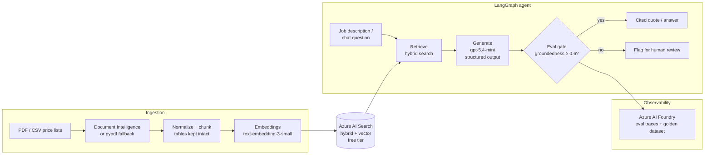

# QuoteKit

**Grounded AI quoting & knowledge platform** — one retrieval/eval core, two products:

1. **QuoteKit** — turns a plain-language job description ("rebuild a 200 sq ft deck, pressure-treated, two stairs") into a structured, line-itemed quote where **every line item cites the source document** it was priced from.
2. **Website Brain** — an embeddable, grounded chat widget for any small business, backed by the same index + eval gate.

Built on **Azure AI Foundry, Azure AI Search, LangChain/LangGraph, FastAPI**.

> The differentiator is the **evaluation gate**: no answer reaches the user unless it passes a groundedness check against the retrieved sources. High-confidence results auto-apply; low-confidence results are flagged for human review — the same confidence-thresholding pattern used in production agentic systems.

## Architecture



## Why the costs stay near zero

| Component | SKU | Idle cost |
|---|---|---|
| Azure AI Search | Free tier (50 MB, 3 indexes) | $0 |
| Azure OpenAI (via AI Foundry) | gpt-5.4-mini + text-embedding-3-small, pay-per-token | $0 idle, pennies per demo session |
| API | Container Apps, scale-to-zero | $0 idle |
| Frontend / widget | Static Web Apps free tier | $0 |
| Demo hardening | IP rate limits, per-session token caps, cached canned answers (`DEMO_MODE`) | — |

## Repo layout

```
apps/api/          FastAPI + LangGraph backend (ingest, quote, chat, eval gate)
apps/web/          Demo UI (static, deploys to Azure Static Web Apps)
packages/widget/   Embeddable chat widget (one <script> tag per customer)
infra/             Bicep templates, deployed with `azd up`
evals/             Golden dataset + eval runner (azure-ai-evaluation)
data/samples/      Sample contractor price list for the demo index
docs/              Architecture and design notes
```

## Quick start (local)

```bash
cd apps/api
python -m venv .venv && source .venv/bin/activate
pip install -r requirements.txt
cp ../../.env.example .env   # fill in your Azure endpoints/keys, or set DEMO_MODE=true
uvicorn app.main:app --reload
```

- `POST /ingest` — upload a price list (CSV/PDF), normalize, embed, index
- `POST /quote` — job description → structured quote with citations + confidence
- `POST /chat` — grounded Q&A over the index (Website Brain)
- `GET  /healthz` — liveness

Set `DEMO_MODE=true` to run without any Azure resources (canned retrieval + responses) — useful for UI work and zero-cost public demos.

## Deploy

```bash
azd auth login
azd up
```

Provisions: resource group, Azure AI Search (free), Azure OpenAI with `gpt-5.4-mini` + `text-embedding-3-small` deployments, Container App (scale-to-zero), Log Analytics.

## Evals

```bash
python evals/run_evals.py
```

Runs the golden dataset (`evals/golden_quotes.jsonl`) through the pipeline and scores **groundedness, context precision, and context recall** with `azure-ai-evaluation`. CI fails if groundedness drops below threshold — retrieval regressions never ship silently.
